# VibeFinance - Architecture Diagrams

## 🏗️ System Architecture

### High-Level Overview

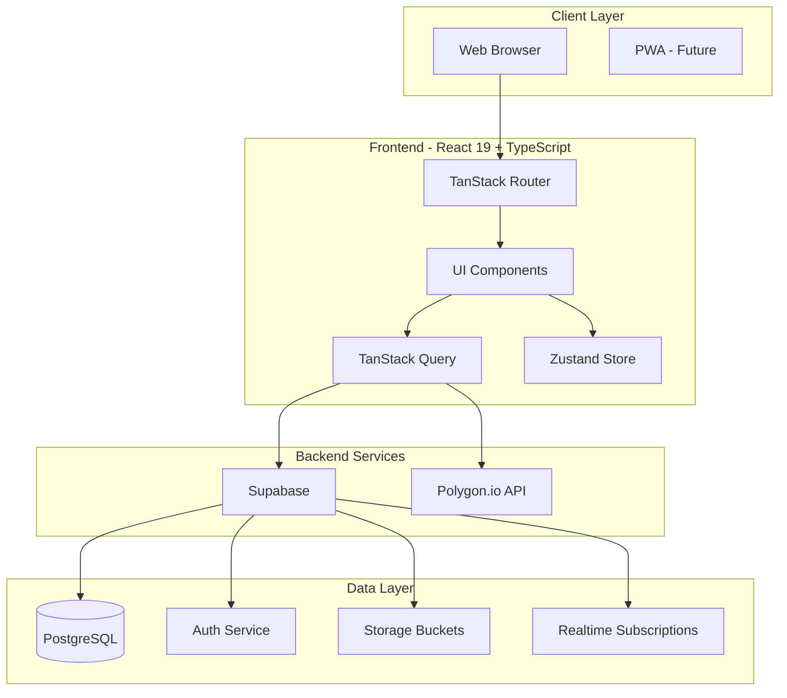

---

## 🔄 Data Flow Architecture

### Portfolio Value Calculation Flow

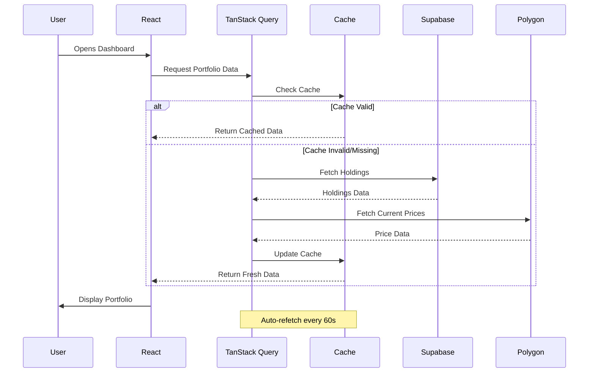

---

## 🗄️ Database Schema Relationships

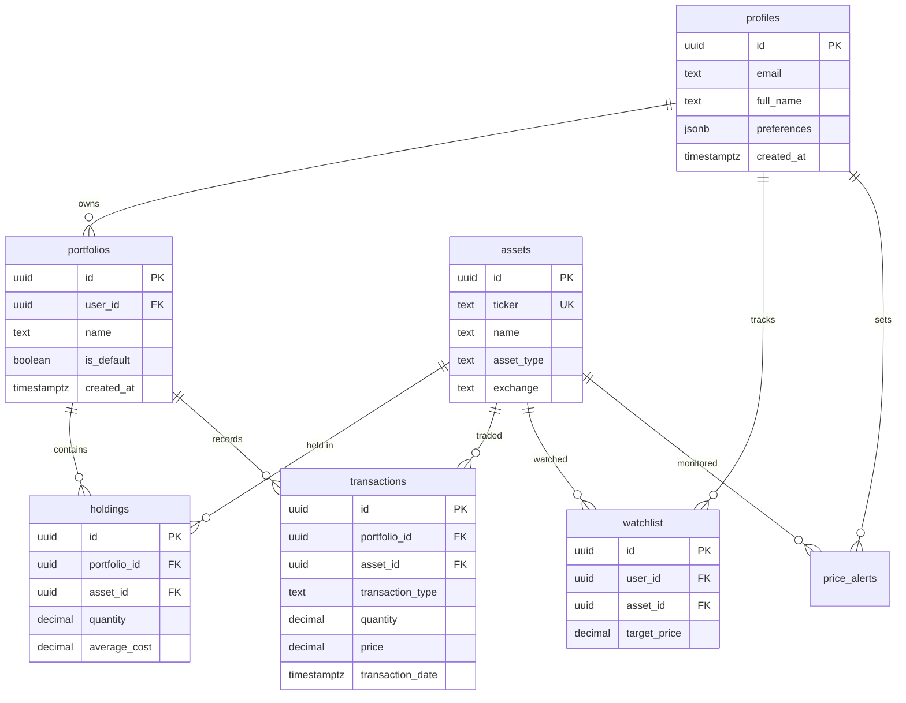

---

## 🔐 Authentication Flow

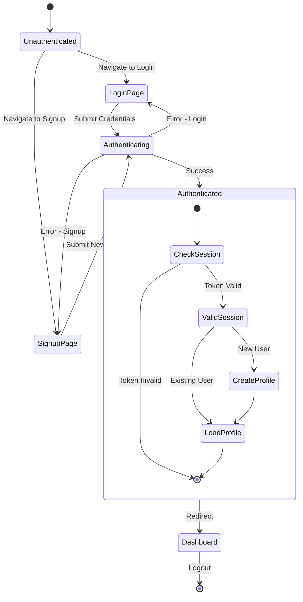

---

## 📊 Component Hierarchy

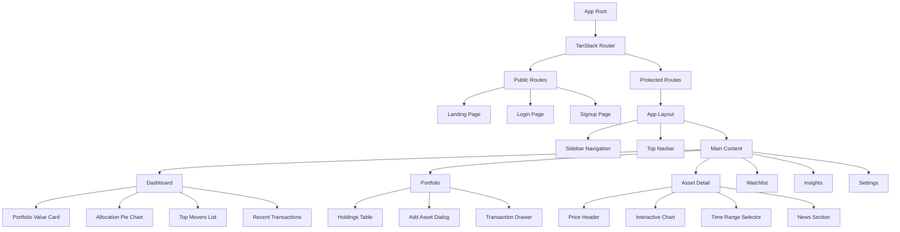

---

## 🔄 State Management Strategy

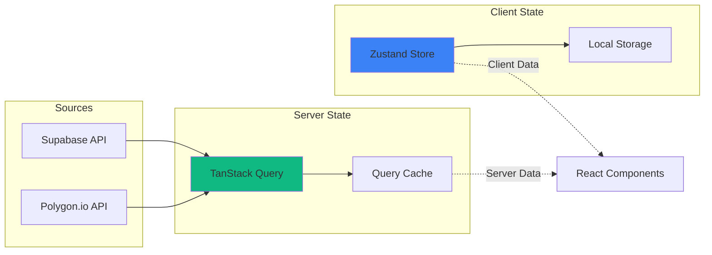

**Server State** - TanStack Query
- Portfolio data
- Asset prices
- Transactions
- User profile
- Market news

**Client State** - Zustand
- Theme preference
- UI state - modals, drawers
- Form state - temporary
- User preferences

---

## 🚀 Deployment Architecture

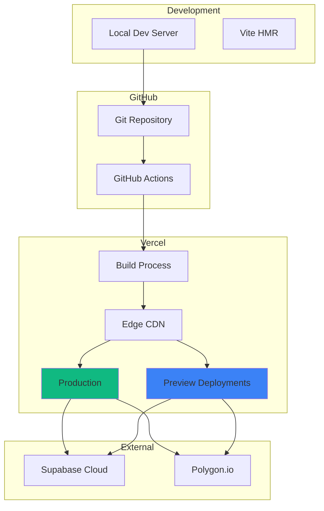

---

## 📱 Responsive Design Breakpoints

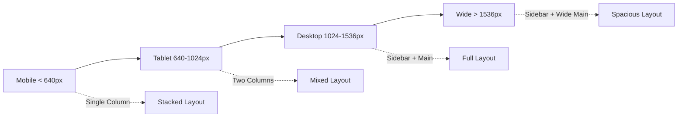

**Mobile** - sm: 640px
- Single column
- Hamburger menu
- Stacked cards
- Compact charts

**Tablet** - md: 768px, lg: 1024px
- Two columns
- Collapsible sidebar
- Grid layouts
- Medium charts

**Desktop** - xl: 1280px
- Full sidebar
- Multi-column grids
- Large charts
- All features visible

**Wide** - 2xl: 1536px
- Expanded layouts
- Side panels
- Maximum data density

---

## 🎨 Theme System Flow

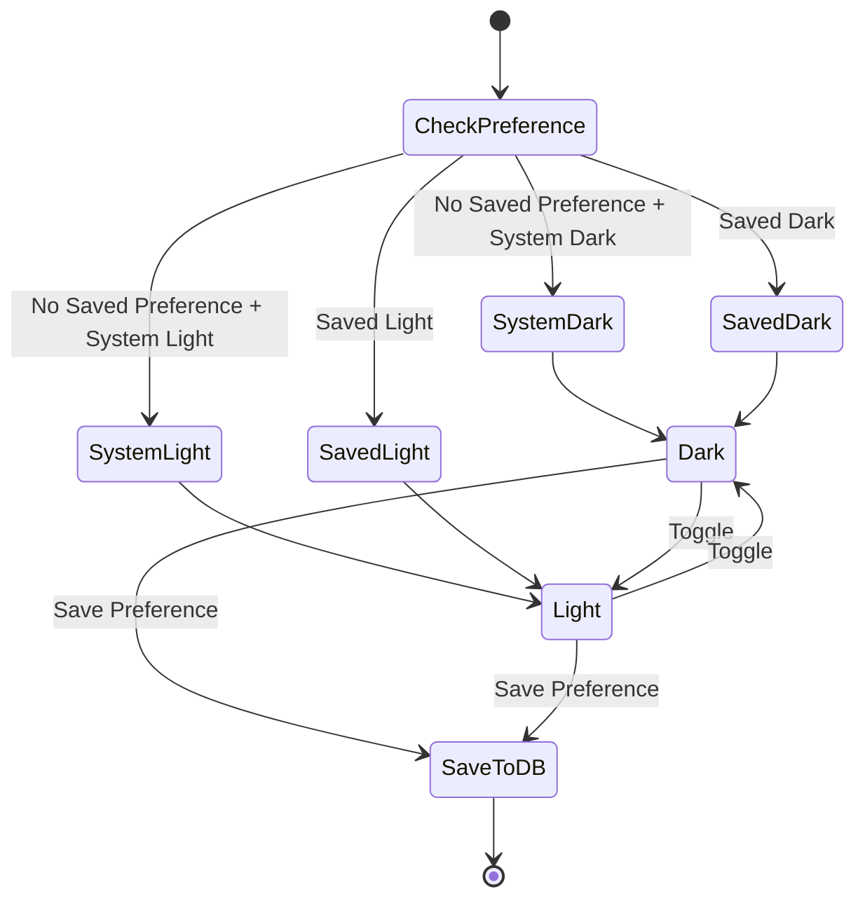

---

## 🔌 API Integration Patterns

### Polygon.io Rate Limiting

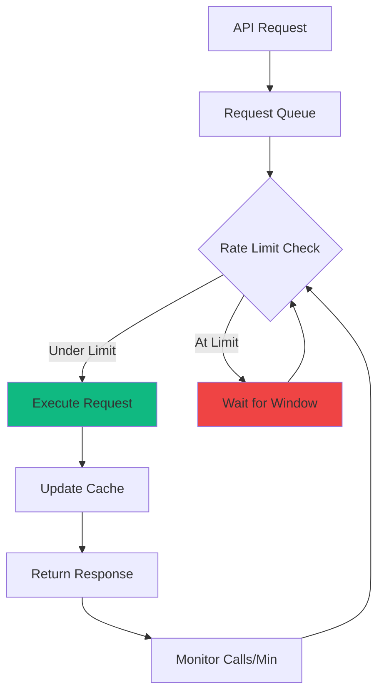

**Rate Limit:** 5 calls/minute (free tier)

**Strategies:**
1. Aggressive caching - 60s staleTime
2. Batch requests when possible
3. Request queue with rate limiter
4. Fallback to cached data
5. Mock data in development

---

## 🔒 Security Layers

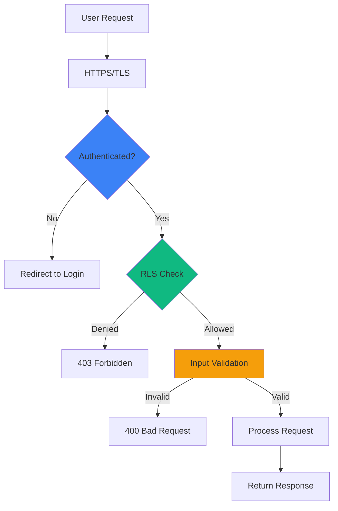

**Security Layers:**
1. HTTPS - Encrypted transport
2. Authentication - Supabase JWT
3. Row Level Security - PostgreSQL RLS
4. Input Validation - Zod schemas
5. API Key Security - Environment variables

---

## 📊 Performance Optimization Flow

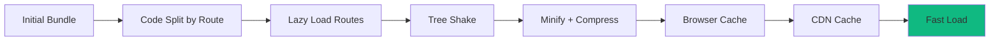

**Optimization Techniques:**
- Code splitting by route
- Lazy loading components
- Tree shaking unused code
- Minification and compression
- Image optimization
- Font subsetting
- Preloading critical resources

**Target Metrics:**
- FCP < 1.5s
- TTI < 3.5s
- Bundle < 150KB
- Lighthouse > 90

---

## 🧪 Error Handling Strategy

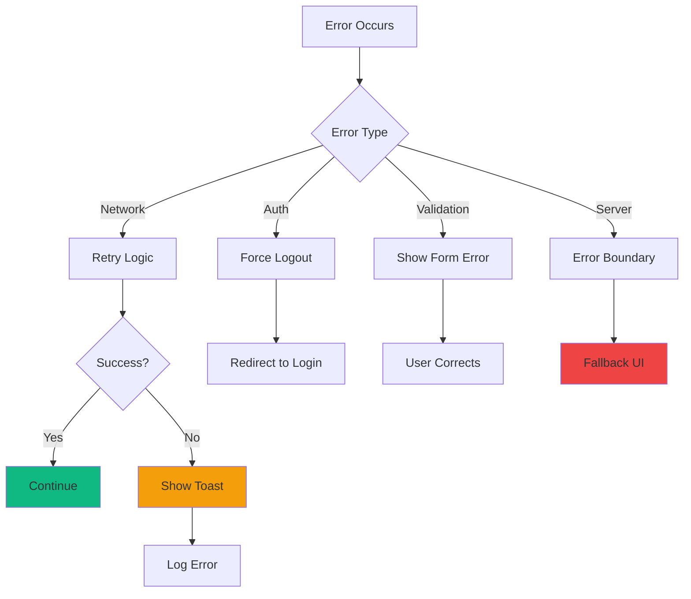

---

## 🔮 Future Architecture Extensions

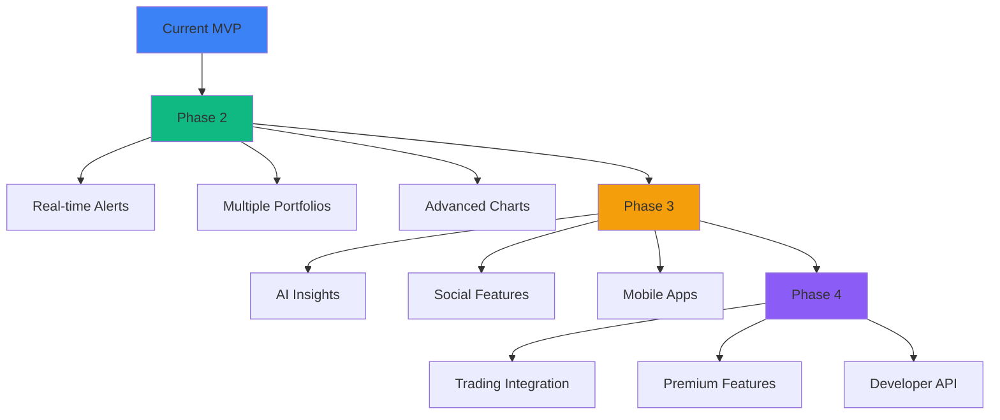

---

**Last Updated:** 2026-04-08  
**Status:** Architecture diagrams complete
