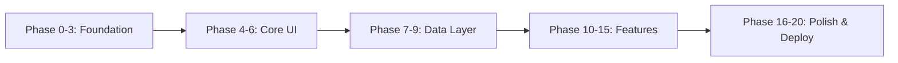

# VibeFinance - Implementation Roadmap

## 🎯 Overview

This roadmap breaks down the entire VibeFinance project into actionable phases with clear deliverables and dependencies.

---

## 📅 Implementation Timeline



---

## Phase 0: Project Initialization

**Goal:** Set up GitHub repository and project structure

### Tasks
- [ ] Create GitHub repository (private)
- [ ] Initialize with README and .gitignore
- [ ] Set up project board/issues
- [ ] Create initial branch structure (main, develop)

### Deliverables
- GitHub repository URL
- Initial commit with README

### Time Estimate
Setup only - no coding yet

---

## Phase 1: Core Development Environment

**Goal:** Scaffold React + TypeScript + Vite project

### Tasks
- [ ] Run `npm create vite@latest vibefinance -- --template react-ts`
- [ ] Install and configure Tailwind CSS
- [ ] Set up TypeScript paths (`@/*` imports)
- [ ] Configure Vite with optimal settings
- [ ] Verify dev server runs

### Deliverables
- Working Vite dev server
- Tailwind CSS configured
- TypeScript compiling

### Dependencies
- Node.js 20+ installed
- npm or pnpm

### Commands
```bash
npm create vite@latest vibefinance -- --template react-ts
cd vibefinance
npm install
npm install -D tailwindcss postcss autoprefixer
npx tailwindcss init -p
```

---

## Phase 2: Install Dependencies

**Goal:** Install all required packages and tools

### Tasks
- [ ] Install shadcn/ui
- [ ] Install TanStack Query + Router
- [ ] Install Zustand
- [ ] Install form libraries (React Hook Form + Zod)
- [ ] Install charting library (Recharts)
- [ ] Install utility libraries
- [ ] Install Supabase client
- [ ] Install dev tools (ESLint, Prettier, Husky)

### Deliverables
- All dependencies in package.json
- shadcn/ui initialized
- ESLint + Prettier configured

### Reference
See [`dependencies.md`](dependencies.md) for full list

---

## Phase 3: Folder Structure

**Goal:** Create organized project structure

### Tasks
- [ ] Create folder structure per architecture doc
- [ ] Set up path aliases in tsconfig
- [ ] Create barrel exports (index.ts files)
- [ ] Add placeholder README files in key directories

### Deliverables
- Complete folder structure
- Working path aliases

### Structure
```
src/
├── app/routes/
├── components/{ui,layout,finance,shared}/
├── features/{auth,portfolio,dashboard,assets,watchlist}/
├── hooks/
├── lib/{api,utils,constants,validators}/
├── stores/
├── types/
└── styles/
```

---

## Phase 4: Supabase Backend Setup

**Goal:** Configure database and authentication

### Tasks
- [ ] Create Supabase project
- [ ] Run database schema migrations
- [ ] Set up Row Level Security policies
- [ ] Configure authentication providers (email + Google)
- [ ] Add seed data (sample assets)
- [ ] Get API keys
- [ ] Add environment variables

### Deliverables
- Supabase project live
- Database schema created
- Auth configured
- API keys in .env.local

### Reference
See [`supabase-setup.md`](supabase-setup.md) for detailed steps

---

## Phase 5: Design System & Core UI

**Goal:** Build reusable UI components

### Tasks
- [ ] Set up CSS variables for theming
- [ ] Install shadcn/ui components (button, card, dialog, etc.)
- [ ] Create custom theme variants
- [ ] Build color system (success/warning/error)
- [ ] Set up dark/light mode toggle
- [ ] Create typography system
- [ ] Build loading skeletons
- [ ] Build error boundary component

### Deliverables
- Complete design system
- All shadcn/ui components installed
- Theme toggle working

### Key Files
- `src/styles/globals.css`
- `src/components/ui/*`
- `src/components/theme/theme-toggle.tsx`

---

## Phase 6: Layout Structure

**Goal:** Build application shell

### Tasks
- [ ] Create app layout component
- [ ] Build sidebar navigation
- [ ] Build top navbar
- [ ] Build mobile navigation
- [ ] Add theme toggle to navbar
- [ ] Create footer (optional)
- [ ] Test responsive breakpoints

### Deliverables
- Complete app layout
- Working navigation
- Mobile-responsive

### Key Files
- `src/components/layout/app-layout.tsx`
- `src/components/layout/sidebar.tsx`
- `src/components/layout/navbar.tsx`
- `src/components/layout/mobile-nav.tsx`

---

## Phase 7: Authentication Flow

**Goal:** Implement user authentication

### Tasks
- [ ] Set up Supabase auth client
- [ ] Create auth store (Zustand)
- [ ] Build login page
- [ ] Build signup page
- [ ] Build password reset flow
- [ ] Implement Google OAuth
- [ ] Create protected route wrapper
- [ ] Add auth state persistence
- [ ] Build user profile dropdown

### Deliverables
- Working login/signup
- Protected routes
- Google OAuth integration

### Key Files
- `src/lib/api/supabase.ts`
- `src/stores/auth-store.ts`
- `src/app/routes/auth/login.tsx`
- `src/app/routes/auth/signup.tsx`
- `src/features/auth/components/*`

---

## Phase 8: Dashboard

**Goal:** Create portfolio overview dashboard

### Tasks
- [ ] Set up TanStack Query
- [ ] Create portfolio value card
- [ ] Build allocation pie chart
- [ ] Create top movers list
- [ ] Build recent transactions list
- [ ] Add market news widget
- [ ] Implement real-time updates
- [ ] Add loading states

### Deliverables
- Working dashboard
- Real-time portfolio value
- Charts displaying correctly

### Key Files
- `src/app/routes/dashboard/index.tsx`
- `src/features/dashboard/components/*`
- `src/hooks/use-portfolio.ts`

---

## Phase 9: Portfolio Management

**Goal:** Build portfolio CRUD functionality

### Tasks
- [ ] Create holdings table component
- [ ] Build add asset dialog
- [ ] Implement ticker search
- [ ] Build edit holding dialog
- [ ] Build delete confirmation
- [ ] Create transaction log drawer
- [ ] Implement add transaction form
- [ ] Add sorting and filtering
- [ ] Calculate portfolio metrics

### Deliverables
- Full portfolio management
- Working add/edit/delete
- Transaction history

### Key Files
- `src/app/routes/portfolio/index.tsx`
- `src/features/portfolio/components/*`
- `src/hooks/use-ticker-search.ts`

---

## Phase 10: Asset Detail Page

**Goal:** Build individual asset view

### Tasks
- [ ] Create asset detail layout
- [ ] Build price header component
- [ ] Integrate Recharts for price chart
- [ ] Add time range selector
- [ ] Build buy/sell action buttons
- [ ] Display key statistics
- [ ] Show related news
- [ ] Add loading/error states

### Deliverables
- Working asset detail page
- Interactive charts
- Real-time price updates

### Key Files
- `src/app/routes/assets/$ticker.tsx`
- `src/features/assets/components/*`
- `src/hooks/use-historical-data.ts`

---

## Phase 11: Watchlist

**Goal:** Implement asset watchlist

### Tasks
- [ ] Create watchlist table
- [ ] Build add to watchlist button
- [ ] Implement remove from watchlist
- [ ] Add price alert UI
- [ ] Show real-time prices
- [ ] Add quick actions (view chart, add to portfolio)
- [ ] Implement sorting

### Deliverables
- Working watchlist
- Price alerts UI
- Quick actions

### Key Files
- `src/app/routes/watchlist/index.tsx`
- `src/features/watchlist/components/*`

---

## Phase 12: Insights/Agent Feed

**Goal:** Create placeholder for AI insights

### Tasks
- [ ] Design insight card component
- [ ] Create static insights (mock data)
- [ ] Build insight types (performance, allocation, suggestion)
- [ ] Add actionable buttons
- [ ] Create feed layout
- [ ] Document future AI integration points

### Deliverables
- Insights feed with mock data
- Clear structure for future AI

### Key Files
- `src/app/routes/insights/index.tsx`
- `src/features/insights/components/*`

---

## Phase 13: Polygon.io Integration

**Goal:** Connect real-time market data

### Tasks
- [ ] Create Polygon API client
- [ ] Implement rate limiting
- [ ] Create price fetching hooks
- [ ] Implement historical data fetching
- [ ] Add ticker search integration
- [ ] Integrate news API
- [ ] Add error handling
- [ ] Test rate limits

### Deliverables
- Working Polygon.io integration
- Real-time price updates
- Historical charts

### Reference
See [`polygon-api-integration.md`](polygon-api-integration.md)

---

## Phase 14: Settings & Profile

**Goal:** Build user settings page

### Tasks
- [ ] Create settings layout
- [ ] Build profile edit form
- [ ] Add avatar upload
- [ ] Create preferences form (theme, currency)
- [ ] Build password change form
- [ ] Add account deletion option
- [ ] Implement form validation
- [ ] Save preferences to Supabase

### Deliverables
- Working settings page
- Profile editing
- Preferences saving

### Key Files
- `src/app/routes/settings/index.tsx`
- `src/features/settings/components/*`

---

## Phase 15: CSV Export

**Goal:** Implement portfolio export

### Tasks
- [ ] Install papaparse
- [ ] Create export utility function
- [ ] Build export button
- [ ] Format data for CSV
- [ ] Add date range selector
- [ ] Trigger file download
- [ ] Test with various portfolios

### Deliverables
- Working CSV export
- Clean data formatting

### Key Files
- `src/lib/utils/export.ts`
- Export button in portfolio page

---

## Phase 16: UI/UX Polish

**Goal:** Enhance user experience

### Tasks
- [ ] Add loading skeletons everywhere
- [ ] Implement error boundaries
- [ ] Add toast notifications (Sonner)
- [ ] Create empty states
- [ ] Add micro-animations
- [ ] Implement keyboard shortcuts
- [ ] Add tooltips to actions
- [ ] Test all edge cases

### Deliverables
- Polished UI
- Smooth transitions
- Clear feedback

---

## Phase 17: Mobile Responsiveness

**Goal:** Optimize for mobile devices

### Tasks
- [ ] Test on mobile viewports
- [ ] Adjust breakpoints
- [ ] Optimize mobile menu
- [ ] Make tables responsive
- [ ] Test touch interactions
- [ ] Optimize chart sizing
- [ ] Add PWA manifest (optional)
- [ ] Test on real devices

### Deliverables
- Fully responsive app
- Mobile-optimized UI

---

## Phase 18: Testing & Demo Data

**Goal:** Ensure quality and create demo

### Tasks
- [ ] Create demo user account
- [ ] Seed realistic portfolio data
- [ ] Test all user flows
- [ ] Fix bugs discovered
- [ ] Test error scenarios
- [ ] Verify calculations
- [ ] Cross-browser testing
- [ ] Performance testing

### Deliverables
- Demo account ready
- All flows tested
- Bugs fixed

---

## Phase 19: Performance Optimization

**Goal:** Optimize bundle size and speed

### Tasks
- [ ] Implement code splitting
- [ ] Lazy load routes
- [ ] Optimize images
- [ ] Minimize bundle size
- [ ] Add React.memo where needed
- [ ] Run Lighthouse audit
- [ ] Optimize re-renders
- [ ] Add performance monitoring

### Deliverables
- Lighthouse score > 90
- Bundle size < 150KB
- Fast page loads

### Tools
- Vite bundle analyzer
- Chrome DevTools
- Lighthouse CI

---

## Phase 20: Deployment & Handoff

**Goal:** Deploy to production and handoff

### Tasks
- [ ] Set up Vercel project
- [ ] Configure environment variables
- [ ] Deploy to production
- [ ] Set up custom domain (optional)
- [ ] Test production build
- [ ] Create demo video (Loom)
- [ ] Write deployment documentation
- [ ] Create handoff checklist
- [ ] Transfer GitHub access

### Deliverables
- Live production URL
- Demo video
- Complete documentation
- GitHub access transferred

### Vercel Setup
```bash
npm install -g vercel
vercel login
vercel --prod
```

---

## 🎯 Definition of Done (DoD)

Each phase is complete when:

- ✅ All tasks checked off
- ✅ Code committed to Git
- ✅ No console errors
- ✅ Features tested manually
- ✅ Responsive on mobile
- ✅ Follows TypeScript best practices
- ✅ Documentation updated

---

## 🚧 Risk Mitigation

### Potential Risks

1. **Polygon.io rate limits**
   - Mitigation: Aggressive caching, rate limiter implementation

2. **Supabase free tier limits**
   - Mitigation: Monitor usage, optimize queries

3. **Performance issues with large portfolios**
   - Mitigation: Pagination, virtualization

4. **Browser compatibility**
   - Mitigation: Test on Chrome, Firefox, Safari, Edge

5. **Mobile performance**
   - Mitigation: Lazy loading, image optimization

---

## 📊 Progress Tracking

Use GitHub Project Board with columns:
- **Backlog** - Not started
- **In Progress** - Currently working
- **Review** - Needs testing
- **Done** - Completed

---

## 🎉 MVP Success Criteria

The MVP is ready when:

- ✅ User can create account and login
- ✅ User can add stocks/crypto to portfolio
- ✅ Portfolio shows real-time value and gains/losses
- ✅ Charts display historical prices
- ✅ Watchlist works
- ✅ App is fully responsive
- ✅ Dark/light theme works
- ✅ CSV export works
- ✅ Deployed to production
- ✅ No critical bugs

---

## 📚 Next Steps After MVP

### Phase 2 Features
- Real-time price alerts (backend)
- Multiple portfolios
- Advanced charts (candlestick, indicators)
- Dividend tracking
- Performance analytics

### Phase 3 Features
- AI-powered insights
- Social features
- Mobile apps
- Trading integration

---

**Last Updated:** 2026-04-08  
**Status:** Implementation roadmap complete - Ready for execution
