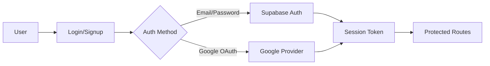
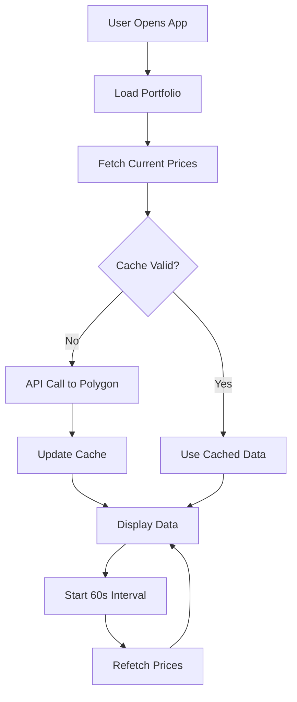

# VibeFinance - Comprehensive Architecture Plan

## 📋 Project Overview

**Project Name:** VibeFinance  
**Type:** Financial Portfolio Tracking Application  
**Tech Stack:** React 19 + TypeScript + Vite + Supabase + Polygon.io  
**Target:** MVP-ready, production-grade financial dashboard

---

## 🎯 Core Requirements

### Pages / Views
1. **Landing/Marketing** (public)
2. **Authentication** (login/signup with email + password + Google OAuth)
3. **Dashboard** (portfolio overview)
4. **Portfolio** (holdings management)
5. **Asset Detail** (charts + news + price data)
6. **Watchlist** (tracked assets)
7. **Insights/Agent Feed** (AI placeholder)
8. **Settings/Profile**

### Key Features (MVP)
- ✅ Add assets by ticker (stocks, ETFs, crypto)
- ✅ Real-time/delayed prices via Polygon.io
- ✅ Portfolio value, total gain/loss, allocation charts
- ✅ Historical price charts (1D, 5D, 1M, 6M, YTD, MAX)
- ✅ Transaction log (buy/sell dates, quantities, cost basis)
- ✅ Watchlist with price alerts (UI only)
- ✅ Dark/light mode (default dark)
- ✅ Fully responsive (mobile-first)
- ✅ Export CSV of portfolio

### Non-Functional Requirements
- 🚀 Blazing fast (Vite + React 19 + TanStack Query)
- 🎨 Beautiful, minimal UI (Tailwind + shadcn/ui)
- ♿ Accessible & SEO-friendly
- 🤖 Ready for agentic backend (clear API structure)

---

## 🏗️ Tech Stack

### Frontend Core
```json
{
  "framework": "React 19",
  "language": "TypeScript 5.x",
  "bundler": "Vite 6.x",
  "styling": "Tailwind CSS 4.x",
  "ui-library": "shadcn/ui (Radix primitives)"
}
```

### State & Data Management
```json
{
  "server-state": "TanStack Query v5",
  "client-state": "Zustand",
  "routing": "TanStack Router",
  "forms": "React Hook Form + Zod",
  "charts": "Recharts"
}
```

### Backend & Services
```json
{
  "backend": "Supabase",
  "auth": "Supabase Auth (email + Google OAuth)",
  "database": "Supabase PostgreSQL",
  "storage": "Supabase Storage",
  "realtime": "Supabase Realtime",
  "market-data": "Polygon.io API (free tier)"
}
```

### Developer Tools
```json
{
  "linting": "ESLint 9",
  "formatting": "Prettier",
  "git-hooks": "Husky + lint-staged",
  "testing": "Vitest + React Testing Library (future)",
  "deployment": "Vercel"
}
```

### Additional Libraries
- `lucide-react` - Icon library
- `date-fns` - Date manipulation
- `sonner` - Toast notifications
- `cmdk` - Command palette
- `react-hot-toast` - Additional toast support
- `recharts` - Charting library
- `class-variance-authority` - CVA for component variants
- `clsx` + `tailwind-merge` - Utility class management

---

## 📁 Folder Structure

```
vibefinance/
├── .github/
│   └── workflows/
│       └── ci.yml
├── public/
│   ├── favicon.ico
│   ├── logo.svg
│   └── og-image.png
├── src/
│   ├── app/                          # TanStack Router routes
│   │   ├── routes/
│   │   │   ├── __root.tsx           # Root layout
│   │   │   ├── index.tsx            # Landing page
│   │   │   ├── auth/
│   │   │   │   ├── login.tsx
│   │   │   │   └── signup.tsx
│   │   │   ├── dashboard/
│   │   │   │   └── index.tsx
│   │   │   ├── portfolio/
│   │   │   │   └── index.tsx
│   │   │   ├── assets/
│   │   │   │   └── $ticker.tsx      # Dynamic asset detail
│   │   │   ├── watchlist/
│   │   │   │   └── index.tsx
│   │   │   ├── insights/
│   │   │   │   └── index.tsx
│   │   │   └── settings/
│   │   │       └── index.tsx
│   │   └── router.tsx
│   ├── components/
│   │   ├── ui/                      # shadcn/ui components
│   │   │   ├── button.tsx
│   │   │   ├── card.tsx
│   │   │   ├── dialog.tsx
│   │   │   ├── dropdown.tsx
│   │   │   ├── input.tsx
│   │   │   ├── table.tsx
│   │   │   ├── tabs.tsx
│   │   │   └── ...
│   │   ├── layout/
│   │   │   ├── app-layout.tsx       # Main app shell
│   │   │   ├── sidebar.tsx
│   │   │   ├── navbar.tsx
│   │   │   ├── mobile-nav.tsx
│   │   │   └── footer.tsx
│   │   ├── finance/                 # Finance-specific components
│   │   │   ├── portfolio-card.tsx
│   │   │   ├── asset-card.tsx
│   │   │   ├── price-ticker.tsx
│   │   │   ├── allocation-chart.tsx
│   │   │   ├── price-chart.tsx
│   │   │   ├── transaction-table.tsx
│   │   │   └── add-asset-dialog.tsx
│   │   ├── theme/
│   │   │   └── theme-toggle.tsx
│   │   └── shared/
│   │       ├── loading-skeleton.tsx
│   │       ├── error-boundary.tsx
│   │       ├── command-palette.tsx
│   │       └── empty-state.tsx
│   ├── features/
│   │   ├── auth/
│   │   │   ├── components/
│   │   │   ├── hooks/
│   │   │   ├── stores/
│   │   │   └── types.ts
│   │   ├── portfolio/
│   │   │   ├── components/
│   │   │   ├── hooks/
│   │   │   ├── stores/
│   │   │   └── types.ts
│   │   ├── dashboard/
│   │   │   ├── components/
│   │   │   ├── hooks/
│   │   │   └── types.ts
│   │   ├── assets/
│   │   │   ├── components/
│   │   │   ├── hooks/
│   │   │   └── types.ts
│   │   └── watchlist/
│   │       ├── components/
│   │       ├── hooks/
│   │       └── types.ts
│   ├── hooks/
│   │   ├── use-portfolio.ts
│   │   ├── use-asset-price.ts
│   │   ├── use-market-data.ts
│   │   ├── use-theme.ts
│   │   ├── use-local-storage.ts
│   │   └── use-debounce.ts
│   ├── lib/
│   │   ├── api/
│   │   │   ├── polygon.ts           # Polygon.io client
│   │   │   └── supabase.ts          # Supabase client
│   │   ├── utils/
│   │   │   ├── cn.ts                # Class name utility
│   │   │   ├── format.ts            # Number/date formatting
│   │   │   ├── calculations.ts      # Portfolio calculations
│   │   │   └── export.ts            # CSV export
│   │   ├── constants/
│   │   │   ├── colors.ts
│   │   │   ├── intervals.ts
│   │   │   └── navigation.ts
│   │   └── validators/
│   │       ├── auth.ts
│   │       └── portfolio.ts
│   ├── stores/
│   │   ├── auth-store.ts
│   │   ├── portfolio-store.ts
│   │   ├── theme-store.ts
│   │   └── ui-store.ts
│   ├── types/
│   │   ├── api.ts
│   │   ├── portfolio.ts
│   │   ├── asset.ts
│   │   ├── transaction.ts
│   │   └── user.ts
│   ├── styles/
│   │   ├── globals.css
│   │   └── themes.css
│   ├── assets/
│   │   ├── images/
│   │   └── icons/
│   ├── main.tsx
│   ├── App.tsx
│   └── vite-env.d.ts
├── .env.example
├── .env.local
├── .eslintrc.cjs
├── .prettierrc
├── .gitignore
├── components.json              # shadcn/ui config
├── index.html
├── package.json
├── postcss.config.js
├── tailwind.config.ts
├── tsconfig.json
├── tsconfig.node.json
├── vite.config.ts
└── README.md
```

---

## 🗄️ Supabase Database Schema

### Tables

#### `profiles`
```sql
CREATE TABLE profiles (
  id UUID PRIMARY KEY REFERENCES auth.users(id) ON DELETE CASCADE,
  email TEXT UNIQUE NOT NULL,
  full_name TEXT,
  avatar_url TEXT,
  preferences JSONB DEFAULT '{"theme": "dark", "currency": "USD"}'::jsonb,
  created_at TIMESTAMPTZ DEFAULT NOW(),
  updated_at TIMESTAMPTZ DEFAULT NOW()
);
```

#### `portfolios`
```sql
CREATE TABLE portfolios (
  id UUID PRIMARY KEY DEFAULT uuid_generate_v4(),
  user_id UUID REFERENCES profiles(id) ON DELETE CASCADE,
  name TEXT NOT NULL DEFAULT 'My Portfolio',
  description TEXT,
  is_default BOOLEAN DEFAULT false,
  created_at TIMESTAMPTZ DEFAULT NOW(),
  updated_at TIMESTAMPTZ DEFAULT NOW()
);
```

#### `assets`
```sql
CREATE TABLE assets (
  id UUID PRIMARY KEY DEFAULT uuid_generate_v4(),
  ticker TEXT NOT NULL,
  name TEXT NOT NULL,
  asset_type TEXT NOT NULL, -- 'stock', 'etf', 'crypto'
  exchange TEXT,
  logo_url TEXT,
  created_at TIMESTAMPTZ DEFAULT NOW()
);
```

#### `holdings`
```sql
CREATE TABLE holdings (
  id UUID PRIMARY KEY DEFAULT uuid_generate_v4(),
  portfolio_id UUID REFERENCES portfolios(id) ON DELETE CASCADE,
  asset_id UUID REFERENCES assets(id) ON DELETE CASCADE,
  quantity DECIMAL(20, 8) NOT NULL,
  average_cost DECIMAL(20, 8) NOT NULL,
  created_at TIMESTAMPTZ DEFAULT NOW(),
  updated_at TIMESTAMPTZ DEFAULT NOW(),
  UNIQUE(portfolio_id, asset_id)
);
```

#### `transactions`
```sql
CREATE TABLE transactions (
  id UUID PRIMARY KEY DEFAULT uuid_generate_v4(),
  portfolio_id UUID REFERENCES portfolios(id) ON DELETE CASCADE,
  asset_id UUID REFERENCES assets(id) ON DELETE CASCADE,
  transaction_type TEXT NOT NULL, -- 'buy', 'sell'
  quantity DECIMAL(20, 8) NOT NULL,
  price DECIMAL(20, 8) NOT NULL,
  fees DECIMAL(20, 8) DEFAULT 0,
  transaction_date TIMESTAMPTZ NOT NULL,
  notes TEXT,
  created_at TIMESTAMPTZ DEFAULT NOW()
);
```

#### `watchlist`
```sql
CREATE TABLE watchlist (
  id UUID PRIMARY KEY DEFAULT uuid_generate_v4(),
  user_id UUID REFERENCES profiles(id) ON DELETE CASCADE,
  asset_id UUID REFERENCES assets(id) ON DELETE CASCADE,
  target_price DECIMAL(20, 8),
  notes TEXT,
  created_at TIMESTAMPTZ DEFAULT NOW(),
  UNIQUE(user_id, asset_id)
);
```

#### `price_alerts`
```sql
CREATE TABLE price_alerts (
  id UUID PRIMARY KEY DEFAULT uuid_generate_v4(),
  user_id UUID REFERENCES profiles(id) ON DELETE CASCADE,
  asset_id UUID REFERENCES assets(id) ON DELETE CASCADE,
  alert_type TEXT NOT NULL, -- 'above', 'below'
  target_price DECIMAL(20, 8) NOT NULL,
  is_active BOOLEAN DEFAULT true,
  triggered_at TIMESTAMPTZ,
  created_at TIMESTAMPTZ DEFAULT NOW()
);
```

### Row Level Security (RLS) Policies

```sql
-- Enable RLS on all tables
ALTER TABLE profiles ENABLE ROW LEVEL SECURITY;
ALTER TABLE portfolios ENABLE ROW LEVEL SECURITY;
ALTER TABLE holdings ENABLE ROW LEVEL SECURITY;
ALTER TABLE transactions ENABLE ROW LEVEL SECURITY;
ALTER TABLE watchlist ENABLE ROW LEVEL SECURITY;
ALTER TABLE price_alerts ENABLE ROW LEVEL SECURITY;

-- Profiles policies
CREATE POLICY "Users can view own profile"
  ON profiles FOR SELECT
  USING (auth.uid() = id);

CREATE POLICY "Users can update own profile"
  ON profiles FOR UPDATE
  USING (auth.uid() = id);

-- Portfolios policies
CREATE POLICY "Users can view own portfolios"
  ON portfolios FOR SELECT
  USING (auth.uid() = user_id);

CREATE POLICY "Users can insert own portfolios"
  ON portfolios FOR INSERT
  WITH CHECK (auth.uid() = user_id);

CREATE POLICY "Users can update own portfolios"
  ON portfolios FOR UPDATE
  USING (auth.uid() = user_id);

CREATE POLICY "Users can delete own portfolios"
  ON portfolios FOR DELETE
  USING (auth.uid() = user_id);

-- Similar policies for holdings, transactions, watchlist, price_alerts...
```

---

## 🔌 API Integration Architecture

### Polygon.io Integration

#### Rate Limits (Free Tier)
- 5 API calls per minute
- Delayed data (15 minutes)

#### Caching Strategy
```typescript
// TanStack Query configuration
const queryClient = new QueryClient({
  defaultOptions: {
    queries: {
      staleTime: 60_000, // 1 minute
      cacheTime: 300_000, // 5 minutes
      refetchOnWindowFocus: false,
      retry: 2,
    },
  },
});
```

#### API Endpoints Used
- `/v2/aggs/ticker/{ticker}/range/{multiplier}/{timespan}/{from}/{to}` - Historical data
- `/v2/snapshot/locale/us/markets/stocks/tickers/{ticker}` - Current price
- `/v3/reference/tickers` - Ticker search
- `/v2/reference/news` - Market news

#### API Client Structure
```typescript
// lib/api/polygon.ts
interface PolygonClient {
  getCurrentPrice(ticker: string): Promise<PriceData>;
  getHistoricalData(ticker: string, timespan: Timespan): Promise<HistoricalData[]>;
  searchTickers(query: string): Promise<TickerResult[]>;
  getNews(ticker?: string): Promise<NewsArticle[]>;
}
```

### Supabase Integration

#### Authentication Flow


#### Real-time Subscriptions
```typescript
// Subscribe to portfolio changes
supabase
  .channel('portfolio-changes')
  .on('postgres_changes', 
    { event: '*', schema: 'public', table: 'holdings' },
    (payload) => {
      queryClient.invalidateQueries(['portfolio']);
    }
  )
  .subscribe();
```

---

## 🎨 Design System

### Color Palette

#### Dark Mode (Default)
```css
:root[data-theme="dark"] {
  --background: 222.2 84% 4.9%;
  --foreground: 210 40% 98%;
  --card: 222.2 84% 4.9%;
  --card-foreground: 210 40% 98%;
  --primary: 142.1 76.2% 36.3%;      /* Green for gains */
  --secondary: 217.2 32.6% 17.5%;
  --accent: 217.2 32.6% 17.5%;
  --destructive: 0 62.8% 30.6%;      /* Red for losses */
  --muted: 217.2 32.6% 17.5%;
  --border: 217.2 32.6% 17.5%;
  --ring: 142.1 76.2% 36.3%;
}
```

#### Light Mode
```css
:root[data-theme="light"] {
  --background: 0 0% 100%;
  --foreground: 222.2 84% 4.9%;
  --card: 0 0% 100%;
  --card-foreground: 222.2 84% 4.9%;
  --primary: 142.1 76.2% 36.3%;
  --secondary: 210 40% 96.1%;
  --accent: 210 40% 96.1%;
  --destructive: 0 84.2% 60.2%;
  --muted: 210 40% 96.1%;
  --border: 214.3 31.8% 91.4%;
  --ring: 142.1 76.2% 36.3%;
}
```

### Typography
```typescript
const typography = {
  fontFamily: {
    sans: ['Inter var', 'system-ui', 'sans-serif'],
    mono: ['JetBrains Mono', 'monospace'],
  },
  fontSize: {
    xs: '0.75rem',    // 12px
    sm: '0.875rem',   // 14px
    base: '1rem',     // 16px
    lg: '1.125rem',   // 18px
    xl: '1.25rem',    // 20px
    '2xl': '1.5rem',  // 24px
    '3xl': '1.875rem',// 30px
    '4xl': '2.25rem', // 36px
  },
};
```

### Component Variants
```typescript
// Example: Button variants using CVA
const buttonVariants = cva(
  "inline-flex items-center justify-center rounded-md text-sm font-medium transition-colors",
  {
    variants: {
      variant: {
        default: "bg-primary text-primary-foreground hover:bg-primary/90",
        destructive: "bg-destructive text-destructive-foreground hover:bg-destructive/90",
        outline: "border border-input hover:bg-accent hover:text-accent-foreground",
        ghost: "hover:bg-accent hover:text-accent-foreground",
      },
      size: {
        default: "h-10 px-4 py-2",
        sm: "h-9 rounded-md px-3",
        lg: "h-11 rounded-md px-8",
      },
    },
  }
);
```

---

## 🔄 Data Flow Architecture

### Portfolio Calculations

```typescript
interface PortfolioCalculations {
  totalValue: number;
  totalCost: number;
  totalGainLoss: number;
  totalGainLossPercent: number;
  dayChange: number;
  dayChangePercent: number;
  allocation: AssetAllocation[];
}

// Real-time calculation flow
const usePortfolioValue = (portfolioId: string) => {
  const { data: holdings } = useHoldings(portfolioId);
  const { data: prices } = useAssetPrices(holdings?.map(h => h.ticker));
  
  return useMemo(() => {
    return calculatePortfolioValue(holdings, prices);
  }, [holdings, prices]);
};
```

### Price Update Strategy



---

## 📊 Feature Specifications

### 1. Dashboard View

**Components:**
- Portfolio summary card (total value, daily change)
- Allocation pie chart
- Top gainers/losers list
- Recent transactions
- Market news feed

**Data Requirements:**
- Portfolio holdings with current prices
- Historical prices for change calculations
- Transaction history (last 10)
- News articles (top 5)

### 2. Portfolio Management

**Components:**
- Holdings table (sortable by value, gain/loss, allocation)
- Add asset dialog with ticker search
- Edit holding dialog
- Transaction history drawer
- Export CSV button

**Features:**
- Real-time search with debouncing
- Form validation with Zod
- Optimistic updates
- Toast notifications on success/error

### 3. Asset Detail Page

**Components:**
- Price header (current price, day change)
- Interactive chart (Recharts)
- Time range selector (1D, 5D, 1M, 6M, YTD, MAX)
- Buy/Sell action buttons
- Related news list
- Key statistics (52w high/low, volume, market cap)

**Chart Configuration:**
```typescript
interface ChartConfig {
  type: 'line' | 'candlestick';
  interval: '1min' | '5min' | '1hour' | '1day';
  indicators: ('volume' | 'ma' | 'rsi')[];
}
```

### 4. Watchlist

**Components:**
- Watchlist table
- Add to watchlist dialog
- Price alert configuration
- Quick action buttons (view chart, add to portfolio)

**Features:**
- Price alert UI (backend trigger in Phase 2)
- Real-time price updates
- Sorting and filtering

### 5. Insights/Agent Feed

**Phase 1 (MVP):**
- Static cards with mock insights
- Card types: performance, allocation, suggestion, news
- Template system for future AI integration

**Future Architecture:**
```typescript
interface AgentInsight {
  id: string;
  type: 'performance' | 'allocation' | 'suggestion' | 'news';
  title: string;
  content: string;
  actionable: boolean;
  action?: {
    label: string;
    handler: () => void;
  };
  timestamp: Date;
}
```

---

## 🚀 Performance Optimization Strategy

### Code Splitting
```typescript
// Lazy load routes
const Dashboard = lazy(() => import('./routes/dashboard'));
const Portfolio = lazy(() => import('./routes/portfolio'));
const AssetDetail = lazy(() => import('./routes/assets/$ticker'));
```

### Image Optimization
- Use WebP format with fallbacks
- Lazy load images below fold
- Implement blur-up technique for logos

### Bundle Size Targets
- Initial JS bundle: < 150KB gzipped
- Total page weight: < 500KB
- First Contentful Paint: < 1.5s
- Time to Interactive: < 3.5s

### Caching Strategy
- Service Worker for offline support (future)
- LocalStorage for theme preference
- IndexedDB for offline portfolio data (future)

---

## 🧪 Testing Strategy (Future Phases)

### Unit Tests (Vitest)
- Utility functions (calculations, formatting)
- Custom hooks
- Store logic

### Component Tests (React Testing Library)
- UI components in isolation
- User interactions
- Error states

### Integration Tests
- Auth flow
- Portfolio CRUD operations
- Chart interactions

### E2E Tests (Playwright)
- Critical user journeys
- Cross-browser compatibility

---

## 🔐 Security Considerations

### Environment Variables
```env
VITE_SUPABASE_URL=
VITE_SUPABASE_ANON_KEY=
VITE_POLYGON_API_KEY=
VITE_APP_URL=
```

### Best Practices
- Never expose API keys in client code
- Use Supabase RLS for data access control
- Implement rate limiting on API calls
- Sanitize user inputs
- Use HTTPS only
- Implement CORS properly

---

## 📦 Deployment Strategy

### Vercel Configuration
```json
{
  "buildCommand": "npm run build",
  "outputDirectory": "dist",
  "devCommand": "npm run dev",
  "framework": "vite",
  "installCommand": "npm install"
}
```

### Environment Setup
- Production: `main` branch → auto-deploy
- Preview: Pull requests → preview deployments
- Development: Local environment

### CI/CD Pipeline
```yaml
# .github/workflows/ci.yml
name: CI
on: [push, pull_request]
jobs:
  build:
    runs-on: ubuntu-latest
    steps:
      - uses: actions/checkout@v4
      - uses: actions/setup-node@v4
      - run: npm install
      - run: npm run build
      - run: npm run lint
```

---

## 📈 Future Enhancements (Post-MVP)

### Phase 2 Features
- Real-time price alerts (backend + push notifications)
- Multiple portfolios
- Social sharing (portfolio performance)
- Dividend tracking
- Tax loss harvesting suggestions

### Phase 3 Features
- AI-powered insights (using OpenAI/Anthropic)
- Automated trading suggestions
- Portfolio optimization algorithms
- Risk analysis and scoring

### Phase 4 Features
- Mobile apps (React Native)
- Desktop app (Electron)
- Browser extension
- Trading integration (Alpaca API, Interactive Brokers)

---

## 🎯 Success Metrics

### User Engagement
- Daily Active Users (DAU)
- Session duration
- Portfolio updates per session
- Feature adoption rate

### Performance
- Lighthouse score > 90
- Core Web Vitals (all green)
- API response time < 500ms
- Page load time < 2s

### Business
- User retention (D7, D30)
- Conversion rate (free → paid in future)
- User satisfaction score

---

## 📚 Documentation Plan

### Developer Docs
- Architecture overview
- Component library (Storybook future)
- API reference
- Contributing guidelines

### User Docs
- Getting started guide
- Feature tutorials
- FAQ
- Video walkthroughs

---

## 🎨 UI/UX Mockup Structure

### Key Screens Layout

#### Dashboard
```
┌─────────────────────────────────────────┐
│  Sidebar  │   Top Navigation Bar        │
├───────────┼─────────────────────────────┤
│           │  Portfolio Value Card       │
│  Nav      │  ┌──────────┬──────────┐   │
│  Items    │  │ Total    │ Day      │   │
│           │  │ $123,456 │ +$1,234  │   │
│  • Home   │  └──────────┴──────────┘   │
│  • Port   │                              │
│  • Watch  │  Allocation Chart            │
│  • Ins    │  ┌────────────────────┐     │
│           │  │   [Pie Chart]      │     │
│           │  └────────────────────┘     │
│           │                              │
│           │  Holdings Table              │
│           │  ┌────────────────────┐     │
│           │  │ Ticker │ Value  │% │     │
│           │  └────────────────────┘     │
└───────────┴─────────────────────────────┘
```

---

## 🏁 Implementation Phases

### Phase 0: Project Setup
- Create GitHub repository
- Initialize Vite project
- Set up development environment

### Phase 1-5: Foundation
- Install dependencies
- Configure Tailwind + shadcn/ui
- Set up folder structure
- Create Supabase project
- Define database schema

### Phase 6-10: Core Features
- Build layout components
- Implement authentication
- Create dashboard
- Build portfolio management
- Integrate asset detail page

### Phase 11-15: Advanced Features
- Add watchlist
- Create insights placeholder
- Integrate Polygon.io API
- Build settings page
- Implement CSV export

### Phase 16-20: Polish & Deploy
- UI/UX polish
- Mobile optimization
- Testing
- Performance tuning
- Deploy to Vercel

---

## 🛠️ Development Commands

```bash
# Install dependencies
npm install

# Start dev server
npm run dev

# Build for production
npm run build

# Preview production build
npm run preview

# Lint code
npm run lint

# Format code
npm run format

# Type check
npm run type-check

# Run tests (future)
npm run test
```

---

## 📝 Key Design Decisions

### Why TanStack Query?
- Best-in-class server state management
- Automatic caching and background refetching
- Optimistic updates
- Perfect for financial data that changes frequently

### Why Zustand?
- Minimal boilerplate
- TypeScript-first
- Small bundle size (< 1KB)
- Simple API for client state

### Why TanStack Router?
- Type-safe routing
- Built-in data loading
- Code splitting out of the box
- Better DX than React Router

### Why Supabase?
- Complete backend solution
- Real-time subscriptions
- Built-in auth
- PostgreSQL for complex queries
- Great free tier

### Why Polygon.io?
- Better rate limits than Alpha Vantage
- More reliable than free alternatives
- Good documentation
- WebSocket support (future)

---

## 🎯 MVP Definition of Done

- ✅ User can sign up/login with email
- ✅ User can add stocks/crypto to portfolio
- ✅ User can see portfolio value and gain/loss
- ✅ User can view asset details with charts
- ✅ User can add assets to watchlist
- ✅ Real-time price updates (60s interval)
- ✅ Dark/light mode toggle
- ✅ Fully responsive on mobile
- ✅ Export portfolio as CSV
- ✅ Deployed to production on Vercel
- ✅ Sub-2s page load time
- ✅ No console errors

---

## 🤝 Handoff Checklist

- [ ] GitHub repository with full codebase
- [ ] README with setup instructions
- [ ] Environment variables documented
- [ ] Supabase project with schema
- [ ] Polygon.io API key setup
- [ ] Vercel deployment live
- [ ] Demo video (2-minute Loom)
- [ ] Test credentials for demo
- [ ] Documentation in `/docs` folder
- [ ] Known issues list

---

**Last Updated:** 2026-04-08  
**Status:** Architecture Complete - Ready for Implementation
